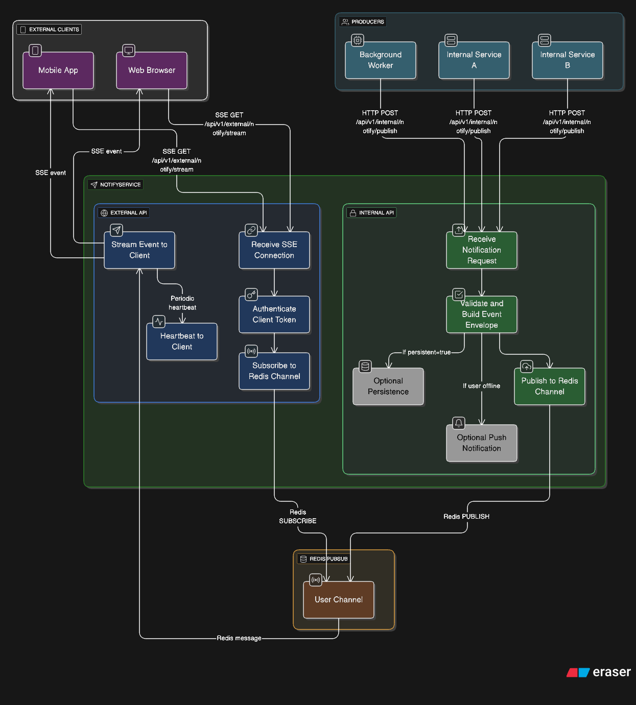

# NotifyService

A lightweight microservice for **real-time notifications**.  
It delivers events to clients via **Server-Sent Events (SSE)**, supports **Redis Pub/Sub** for fan-out, and provides a path for **persistent storage** (TimescaleDB, planned).

---

## Features
- **Internal API**: trusted services publish events without auth.  
- **External API**: clients consume SSE streams with JWT auth.  
- **Redis Pub/Sub**: scalable, low-latency fan-out.  
- **Pluggable Auth**: JWT (v1), DB token / remote AuthService (future).  
- **Persistence (future)**: TimescaleDB for offline history & retention.  
- **Production ready**: Gunicorn + Uvicorn workers, health endpoints, Docker Compose setup.

---

## API Overview
- `POST /api/v1/internal/notify/publish`  
  Accepts event JSON: `{type, user_id, data, permalink?, persistent?}`.  
- `GET /api/v1/external/notify/stream?token=JWT`  
  SSE stream for authenticated user.  
- `GET /api/v1/external/notify/history?token=JWT`  
  Persistent events (stub in v1).  
- Health:  
  - `/api/v1/notify/health/live`  
  - `/api/v1/notify/health/ready`

---

## Architecture

The flow of NotifyService:

- **Producers (internal)** send JSON events via `/api/v1/internal/notify/publish` (no auth, private network).
- **NotifyService**:
  - **Internal API** → receives, validates, publishes to Redis (optional persistence/push).
  - **External API** → authenticates JWT token, subscribes to Redis, streams via SSE.
- **Redis Pub/Sub** → per-user channels, fan-out.
- **External Clients** (web browsers, mobile apps) → connect via SSE to `/api/v1/external/notify/stream`.

### Diagram



**Legend:**
- **Internal API** → trusted network only, no authentication.
- **External API** → public endpoints, JWT authentication required.
- **Redis Pub/Sub** → transient, real-time delivery; persistence optional.
- **SSE Stream** → one connection per user/session; auto-reconnect & heartbeat.

---

## Running Locally
```bash
docker compose up --build
```

Services:
- `notifyservice` → FastAPI + Gunicorn/Uvicorn (port 8000)  
- `redis` → Pub/Sub backend (internal only)

---

## Example Usage

### Publish event (internal network)
```bash
curl -X POST http://localhost:8000/api/v1/internal/notify/publish   -H "Content-Type: application/json"   -d '{"type":"report_ready","user_id":"123","data":{"file":"report.pdf"}}'
```

### Listen (browser)
```js
const es = new EventSource("/api/v1/external/notify/stream?token=YOUR_JWT");
es.onmessage = (e) => console.log("event:", e.data);
```

---

## Deployment
- Reverse proxy with Nginx (buffering disabled for SSE).  
- Scale horizontally (`docker compose up --scale notifyservice=N`).  
- Use health endpoints for readiness/liveness probes.  
- JWT secret and other config via `.env`.

---

## Roadmap
- Persistent notifications in TimescaleDB.  
- Offline push (FCM/APNs/web push).  
- Pluggable auth backends.  
- Redis Streams option for delivery guarantees.  
